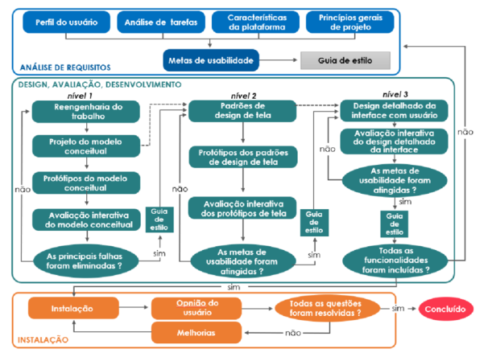

**CICLO DE VIDA DE ENGENHARIA DE USABILIDADE**

# CICLO DE VIDA DE ENGENHARIA DE USABILIDADE

## 1. Características da Plataforma

| Característica | Descrição |
| :---- | :---- |
| **Descrição do Software** | A interface será desenvolvida em **Python**, utilizando as bibliotecas **PyQt5** (para a construção da interface gráfica), **PyTorch** (para o processamento dos modelos de aprendizado profundo) e **YOLO** (para a detecção de pessoas e objetos nas imagens). A aplicação possibilita o carregamento de modelos treinados e a execução de testes diretos sobre imagens ou vídeos capturados em canteiros de obra. |
| **Descrição do Hardware** | **Lado do Usuário:** Computadores de mesa ou notebooks com sistema operacional Windows ou Linux, equipados com placa de vídeo dedicada (GPU NVIDIA recomendada) para aceleração do processamento.   **Lado do Servidor (opcional):** Em caso de uso em rede, os dados podem ser armazenados e processados em servidores locais ou em nuvem, com suporte a execução distribuída.   **Dispositivos de Captura:** Drones e câmeras de segurança utilizadas para coleta de imagens e vídeos no canteiro de obras. |
| **LISTA DE Capacidades da Plataforma (com explicação)** | **Execução de Modelos YOLO:** A interface permite carregar modelos pré-treinados para detectar trabalhadores, máquinas e objetos.   **Visualização Gráfica:** Exibição em tempo real dos frames com detecções e marcações (bounding boxes).   **Geração de Métricas:** Cálculo de precisão, recall e taxa de detecção correta.   **Comparação de Modelos:** Teste de diferentes versões de modelos YOLO para avaliar o desempenho em diversos cenários.   **Exportação de Resultados:** Permite salvar logs e relatórios de desempenho em formato CSV ou PDF. |
| **LISTA DE Restrições da Plataforma (com explicação)** | **Dependência de Hardware:** O desempenho do sistema depende fortemente da GPU. Máquinas sem aceleração gráfica terão desempenho reduzido.   **Limitações de Treinamento:** Modelos de detecção precisam ser previamente treinados, não sendo possível realizar o treinamento completo dentro da interface.   **Dependência de Iluminação e Ângulo:** A acurácia da detecção depende da qualidade da imagem e da posição da câmera.   **Uso Local:** Por ser uma aplicação desktop, o compartilhamento de dados e logs entre usuários requer configuração manual ou rede interna. |

---

## 2. Princípios Gerais do Projeto

| Nome | Descrição | Link |
| :---- | :---- | :---- |
| **Descrição do Contexto** | O sistema é voltado para a análise de segurança em **canteiros de obras**, permitindo que engenheiros e analistas validem o desempenho de **modelos de IA de detecção de riscos** a partir de imagens capturadas por drones ou câmeras fixas. O objetivo é identificar situações de perigo, como aproximação excessiva entre trabalhadores e máquinas, e gerar dados para melhorar protocolos de segurança. | N/A |
| **Lei Geral de Proteção de Dados (LGPD) - Lei n.º 13.709/2018** | Por lidar com imagens que podem conter pessoas, o sistema deve garantir anonimização de rostos e sigilo dos dados capturados, obedecendo à LGPD. O armazenamento de vídeos e resultados deve ser feito de forma segura e controlada. | [Lei nº 13.709/2018 - LGPD](https://www.planalto.gov.br/ccivil_03/_ato2015-2018/2018/lei/l13709.htm) |
| **Lei n.º 10.098/2000 - Lei da Acessibilidade** | A interface PyQt5 deve respeitar diretrizes de acessibilidade, como contraste adequado, fontes legíveis e suporte à navegação por teclado, garantindo que todos os usuários possam utilizar o sistema. | [Lei nº 10.098/2000 - Acessibilidade](https://www.planalto.gov.br/ccivil_03/leis/l10098.htm) |
| **ABNT NBR ISO 9241 - Ergonomia da interação humano-sistema** | A norma orienta o design centrado no usuário, garantindo eficácia, eficiência e satisfação na interação com o sistema. Ela é aplicada para definir fluxos claros, consistentes e intuitivos na interface. | [ISO 9241 - Parte 11](https://www.inf.ufsc.br/~edla.ramos/ine5624/_Walter/Normas/Parte%2011/iso9241-11F2.pdf) |
| **As 10 Heurísticas de Usabilidade de Jakob Nielsen** | São aplicadas para validar a interface, com foco em visibilidade do status do sistema, consistência, prevenção de erros e design minimalista. | [Nielsen Norman Group](https://www.nngroup.com/articles/ten-usability-heuristics/) |

---

## 3. Metas de Usabilidade

### **1. Qualitativo**

- **Clareza das Informações:** O sistema deve exibir as detecções e métricas de forma clara e intuitiva, utilizando cores e ícones para representar diferentes categorias de risco.  
- **Feedback Imediato:** O usuário deve receber respostas visuais imediatas ao carregar um modelo ou iniciar uma análise.  
- **Controle e Flexibilidade:** O usuário pode escolher o modelo a ser testado, definir parâmetros de detecção (ex: confiança mínima) e pausar ou retomar a execução.  
- **Prevenção de Erros:** O sistema deve verificar compatibilidade do modelo e integridade dos arquivos antes da execução.  
- **Consistência e Padrões:** Todos os botões, menus e mensagens seguem o mesmo padrão visual e terminológico.  

---

### **2. Quantitativo**

| Metas | Porcentagem | Justificativa |
| ----- | :---- | :---- |
| **Eficiência e Agilidade na Execução de Testes** | 40% | O foco é garantir que o sistema processe vídeos e imagens com velocidade e fluidez, reduzindo o tempo de análise. |
| **Eficácia na Visualização dos Resultados** | 35% | As detecções e métricas devem ser apresentadas de forma compreensível para que o usuário possa avaliar o desempenho do modelo rapidamente. |
| **Facilidade de Aprendizado e Uso** | 15% | A interface deve ser intuitiva, permitindo que usuários com pouca experiência técnica consigam operar o sistema. |
| **Satisfação e Confiança do Usuário** | 10% | O sistema deve transmitir segurança e confiabilidade, com mensagens claras e feedback visual consistente. |
| **Total** | **100%** | Soma das prioridades de usabilidade. |

---

